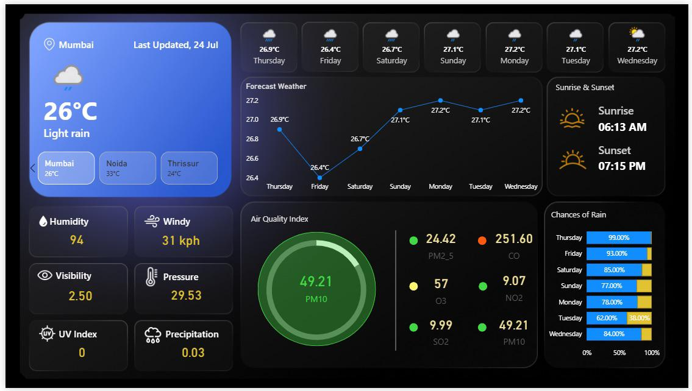
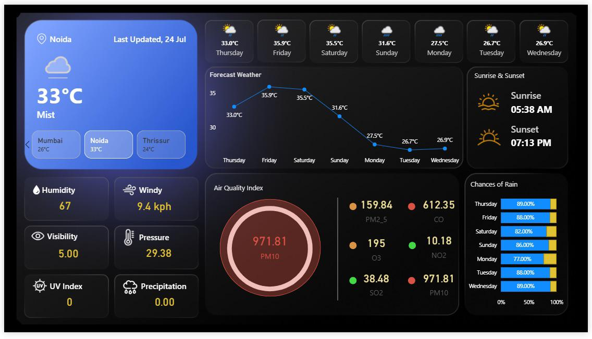

# 🌦️ Live Weather Analysis Dashboard

An elegant, modern, and interactive **Power BI dashboard** for real-time weather monitoring and analysis.  
This project connects **Power BI** to the **WeatherAPI**, delivering live, historical, and forecast weather insights in a stunning neon-themed interface.

---

## ✨ Features

- 📡 **Real-time Weather Data** — Integrated with WeatherAPI (JSON) for live updates.  
- 🌍 **Interactive Maps** — City-level weather insights with dynamic location selection.  
- 🌡️ **Key Metrics at a Glance** — Cards for temperature, humidity, visibility, air pressure, and more.  
- 💨 **Advanced Visuals** — Gauges for wind speed, bar/line charts for daily variations, and rain prediction trends.  
- 🧭 **Air Quality Index (AQI)** — Integrated AQI analysis for a complete environmental overview.  
- 🎨 **Modern Design** — Neon-inspired aesthetic with professional, minimal, and elegant visuals.  
- 🔄 **Dynamic Interactivity** — Filters, slicers, and DAX-powered measures for seamless exploration.  
- 📊 **Historical & Forecast Data** — Weather trends over the last 7 days and future rain predictions.  

---

## 🛠️ Tech Stack

- **Power BI** — Data visualization and dashboard design  
- **WeatherAPI** — Live, historical, and forecast weather data (JSON)  
- **DAX (Data Analysis Expressions)** — Calculated measures and queries  
- **Power Query** — Data modeling and transformation  

---

## 🚀 Installation & Setup

1. Clone the repository:  
   ```bash
   git clone https://github.com/insiya25/Live-Weather-Analysis-Dashboard-Power-BI-Weather-API-
2. Get a free API key from WeatherAPI.
3. Open the Power BI file (.pbix) in Power BI Desktop.
4. Update the API connection with your WeatherAPI key.
5. Refresh the dashboard to load real-time weather data.

## 📷 Dashboard Preview





## 📌 Use Cases
- Personal or business weather monitoring
- Environmental data analysis
- Real-time reporting dashboards
- Educational demonstrations of API + Power BI integration

## 🤝 Contribution
Contributions are welcome!
Feel free to open issues or submit pull requests to improve visuals, features, or documentation.

## 📜 License
This project is licensed under the MIT License — feel free to use and modify.

🙌 Acknowledgements
- WeatherAPI for providing real-time weather data
- Microsoft Power BI for advanced visualization and analytics
